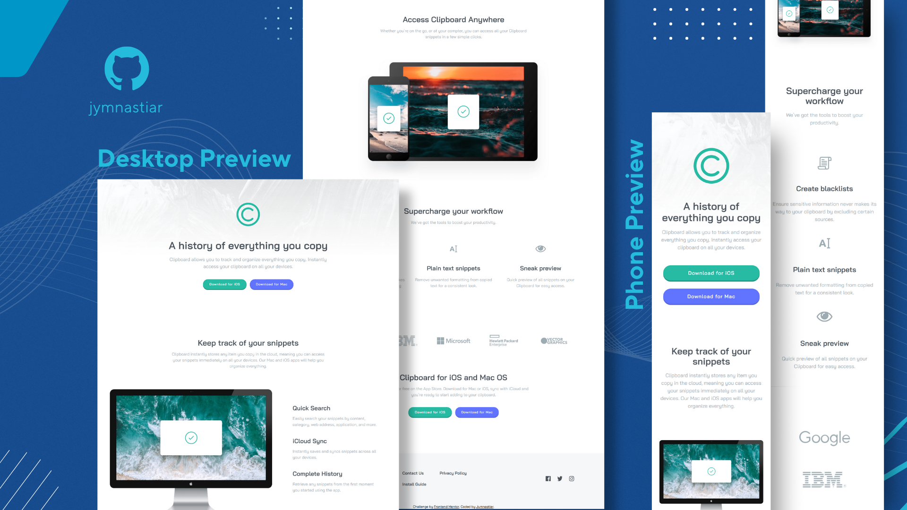

# Frontend Mentor - Clipboard landing page solution

This is a solution to the [Clipboard landing page challenge on Frontend Mentor](https://www.frontendmentor.io/challenges/clipboard-landing-page-5cc9bccd6c4c91111378ecb9). Frontend Mentor challenges help you improve your coding skills by building realistic projects. 

## Table of contents

- [Overview](#overview)
  - [The challenge](#the-challenge)
  - [Screenshot](#screenshot)
  - [Links](#links)
- [My process](#my-process)
  - [Built with](#built-with)
  - [What I learned](#what-i-learned)
  - [Continued development](#continued-development)
  - [Useful resources](#useful-resources)
- [Author](#author)
- [Acknowledgments](#acknowledgments)

## Overview

### The challenge

Users should be able to:

- View the optimal layout for the site depending on their device's screen size
- See hover states for all interactive elements on the page

### Screenshot



### Links

- [Solution URL](https://github.com/jymnastiar/clipboard-landing-page)
- [Live Site URL](https://clipboard-landing-page-jym.vercel.app/)

## My process

### Built with

- Semantic HTML5 markup
- CSS custom properties
- Flexbox
- CSS Grid
- Mobile-first workflow
- Media Queries
- [Vercel](https://vercel.com/)
- [Git](https://git-scm.com/)

### What I learned

During this project, I improved my understanding of how Flexbox works and how it can be used to build flexible and responsive layouts. Previously, I often relied on trial and error, but through this challenge I became more confident in using properties such as      `flex-direction`, `justify-content`, `align-items`, and `flex-wrap` in a more intentional way.

I also learned how Flexbox can be combined with a mobile-first approach to progressively enhance the layout for larger screens using media queries.

Here is a simple example of Flexbox usage from this project:

```css
header .button {
  display: flex;
  justify-content: center;
  flex-wrap: wrap;
  gap: 1rem;
}
```

### Continued development

For future projects, I want to continue improving my layout logic, especially in deciding when to use Flexbox versus CSS Grid. I also plan to practice writing more efficient media queries to handle different screen sizes more smoothly.

In addition, I would like to focus on structuring my CSS in a cleaner and more scalable way as my projects become more complex, while maintaining a strong mobile-first workflow.


### Useful resources

- [Coding2GO](https://www.youtube.com/@coding2go) — This channel helps a lot in mastering CSS.

## Author

- Frontend Mentor - [@jymnastiar](https://www.frontendmentor.io/profile/jymnastiar)